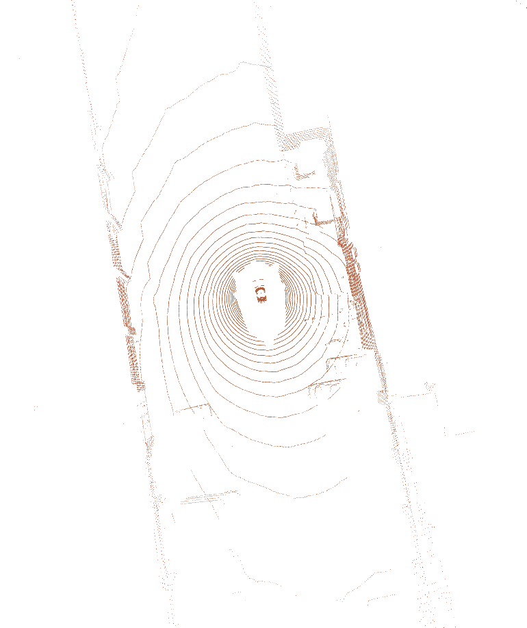
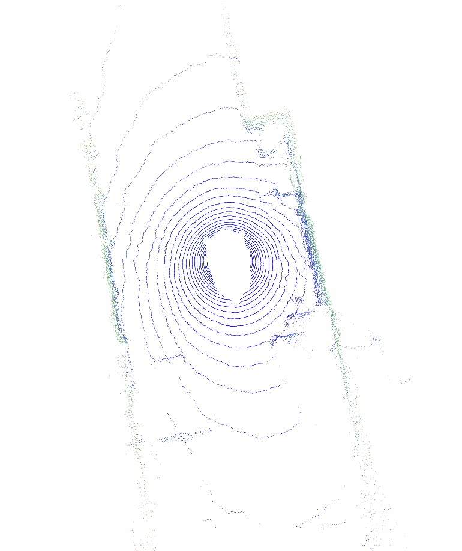
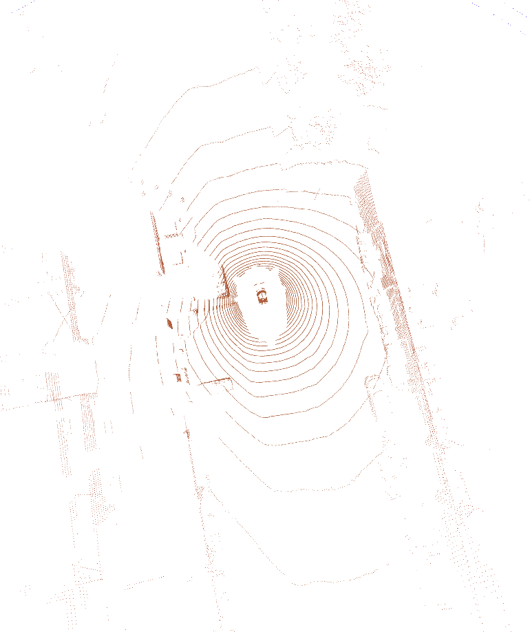
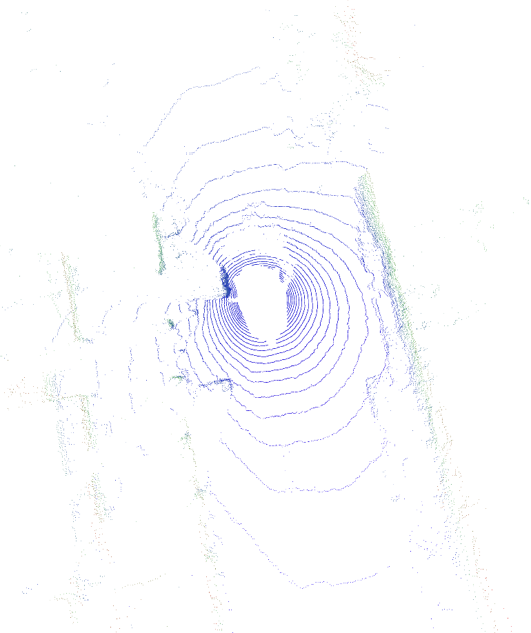
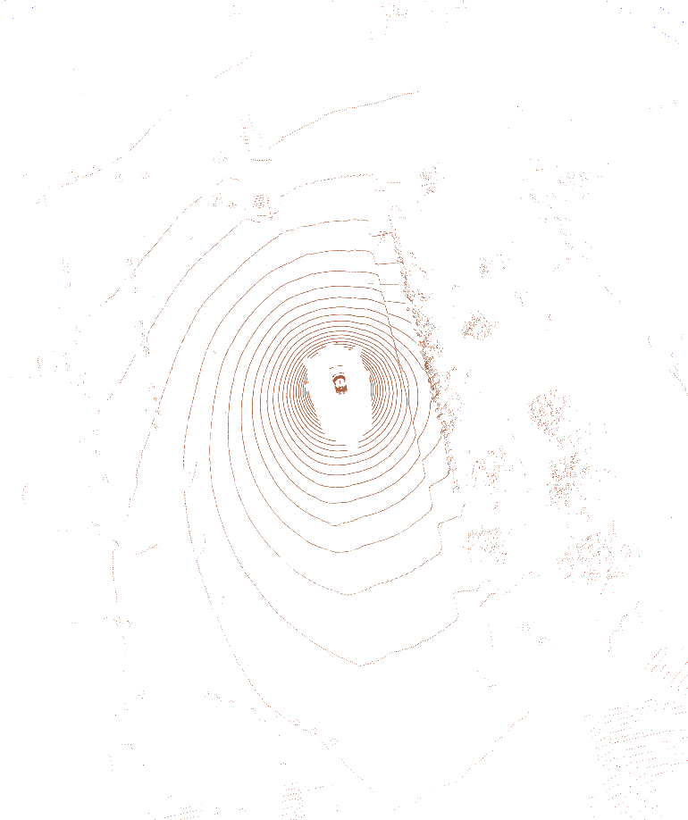
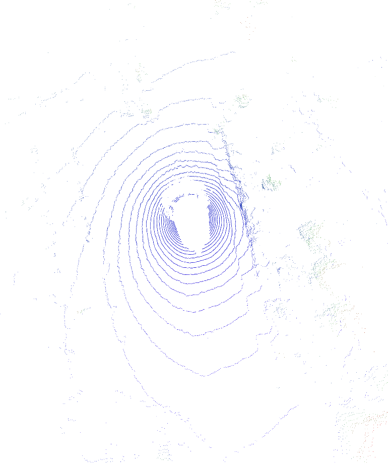

# LiDAR VAE

This repository contains a LiDAR VAE training and evaluation pipeline for
reconstructing NuScenes point clouds from learned neural feature grids. It
includes the model code, the embedded Jormungand NuScenes dataloader,
Docker/Pixi environment files, evaluation metrics, and saved GT/PRED renders.

## Repository Layout

- `autoencoder/`: LiDAR encoder, BEV VAE, neural render head, training script,
  metrics, checkpoints, and render previews.
- `autoencoder/train_lidar_only.py`: main training and validation entry point.
- `autoencoder/renders/`: GT vs PRED render images used in this README.
- `jormungand/`: local copy of the Jormungand dataset/runtime code needed by
  the training script.
- `jormungand/jormungand/datasets/nuscenes/`: NuScenes Lance conversion,
  loading, visualization, and utility code.
- `Dockerfile`, `pixi.toml`, `build_pig.sh`, `launch.sh`: reproducible local
  GPU environment.

## Setup

Run the commands below from the `lidar_vae` directory unless noted otherwise.

### Local Docker

Build the local GPU image:

```bash
bash build_pig.sh
```

Launch the container with GPU access, the NuScenes mount, and port `8080`
forwarded for Viser:

```bash
bash launch.sh
```

The launch script mounts this repository into the container at
`/project/ai-workloads/lidar_vae` and mounts the local NuScenes dataset at
`/data/nuscenes`. Override the Viser port with `LIDAR_VAE_HOST_PORT` if `8080`
is already in use:

```bash
LIDAR_VAE_HOST_PORT=8081 bash launch.sh
```

## Dataset

The repository uses a local copy of the Jormungand dataloader. NuScenes records
are exported to Lance tables, and the training script reads those tables through
`NuScenesLanceDataset`. Each Lance row represents one LiDAR scan. The exporter
keeps the full LiDAR frequency, matches the nearest camera frame per camera
channel, and stores poses, point clouds, image bytes, camera intrinsics, and box
metadata in one table.

The NuScenes release files included here are:

- `nuscenes_to_lance.py`: converts raw NuScenes data into Lance.
- `nuscenes_lance.py`: reads Lance tables and provides the visualization entry
  point.
- `nuscenes_local.py`: local NuScenes API wrapper used by the exporter.
- `nuscenes_dataframe_utils.py`: shared frame, sweep, rig, and aggregation
  utilities.
- `visualize.py`: visualization helper code.
- `nuscenes_class_to_colors.py`: semantic color map for NuScenes classes.

### Convert NuScenes to Lance

Download NuScenes locally so that the raw dataset is available under
`/data/nuscenes`, then export the train/val table:

```bash
python -m jormungand.datasets.nuscenes.nuscenes_to_lance \
  --version v1.0-trainval \
  --data-root /data/nuscenes \
  --output-path /data/nuscenes/v1.0-trainval.lance
```

If you run full test-set validation locally, export the test split as well:

```bash
python -m jormungand.datasets.nuscenes.nuscenes_to_lance \
  --version v1.0-test \
  --data-root /data/nuscenes \
  --output-path /data/nuscenes/v1.0-test.lance
```

The exporter overwrites existing output by default. Use `--no-overwrite` when
you want it to fail instead of replacing an existing Lance table.

### Visualize Lance Data

Use the Lance reader to inspect frames in Viser:

```bash
python -m jormungand.datasets.nuscenes.nuscenes_lance \
  --version v1.0-trainval \
  --data-root /data/nuscenes \
  --index 0 \
  --num-frames 20 \
  --colorize-lidar \
  --frustum-scale 2.0
```

This opens a Viser server on `localhost:8080` inside the container. If you are
using `launch.sh`, that port is forwarded to the host.

## Training

`train_lidar_only.py` is already LiDAR-only, so no camera-disable flag is
required.

### Multi-GPU Training

From `lidar_vae/autoencoder`, set the run name and Python path:

```bash
export RUN_NAME=ai_workloads_rec
mkdir -p logs checkpoints/${RUN_NAME}/lidar_only
export PYTHONPATH=$(pwd):$(pwd)/../jormungand:$(pwd)/../third_party/OpenSceneFlow:${PYTHONPATH}
```

Start four-GPU training:

```bash
CUDA_VISIBLE_DEVICES=0,1,2,3 torchrun --nproc_per_node=4 train_lidar_only.py \
  --max-steps 200000 \
  --batch-size 2 \
  --checkpoint-dir checkpoints/${RUN_NAME}/lidar_only \
  --vae-warmup-steps 10000 \
  --kl-weight 5e-1 \
  --kl-weight-schedule cyclic \
  --kl-cycle-count 4 \
  --kl-cycle-ramp-fraction 0.5 \
  --lr 1e-3 \
  > logs/${RUN_NAME}.log 2>&1 < /dev/null &
```

Follow progress with `tail -f logs/${RUN_NAME}.log`.

Training options:

- `--batch-size`: per-GPU batch size.
- `--num-sweeps`: number of LiDAR sweeps aggregated for encoder input.
- `--max-train-rays 0`: use all rays during training.
- `--test-val/--no-test-val`: enable or disable full test-set validation.
- `--test-metrics/--no-test-metrics`: enable or disable dense point-cloud
  validation metrics.
- `--resume <checkpoint>`: resume from a saved checkpoint.
- `--overfit-samples <N>`: debug on a small fixed subset.

### Runtime Benchmark

Final benchmark* at batch size `4`, with `1000` measured training batches
(`4000` samples) and `200` measured inference batches (`800` samples):

| Phase | Samples | Mean s/batch | Samples/s |
| --- | ---: | ---: | ---: |
| Training | 4000 | 0.9272 | 4.314 |
| Inference | 800 | 0.5881 | 6.801 |

| Phase | PyTorch peak alloc max | GPU device memory max | CPU RSS max | Mean power | Max power | Mean GPU util |
| --- | ---: | ---: | ---: | ---: | ---: | ---: |
| Training | 120.03 GiB | 169.15 GiB | 19.87 GiB | 635.07 W | 736.84 W | 84.94% |
| Inference | 43.15 GiB | 61.11 GiB | 25.24 GiB | 439.00 W | 547.46 W | 49.90% |

*Benchmark collected on a single B200 GPU.

## Results

Checkpoint:

```text
checkpoints/ai_workloads_rec/lidar_only/step_080000.pth
```

Training snapshot at step `80000/200000`, epoch `3`, learning rate
`6.57e-04`:

| Metric | Value |
| --- | ---: |
| depth_loss | 0.0576 |

Test-set validation at step `80000` over `3004` batches:

| Metric | Value |
| --- | ---: |
| depth_loss | 0.0615 |
| chamfer_symmetric_mean | 3.006666 |

## Visualizations

GT vs PRED point-cloud renders from `autoencoder/renders/`:

| Sample | GT | PRED |
| --- | --- | --- |
| 1 |  |  |
| 2 |  |  |
| 3 |  |  |
| 4 |  |  |
