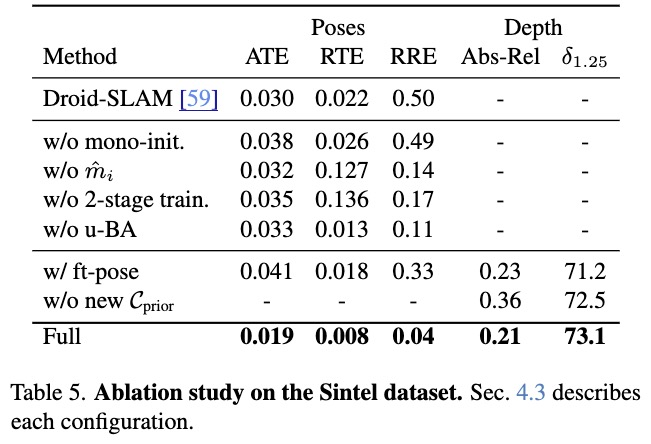

# MegaSaM Workload

AI Workload for [MegaSaM](https://mega-sam.github.io/) a 4D reconstruction method that was an honorable mention for CVPR 2025 best paper.

## Setup

### Requirements

You must have [Pixi](https://pixi.prefix.dev/) installed on your machine with a CUDA 12.1 capable GPU. The script currently supports Ampere (compute capability 8.6) and Hopper (compute capability 9.0), but more options can be added in the build script if they are supported by CUDA 12.1

### Quick Setup

Run `./build.sh`

### Manual Step

First recursively pull submodules.

```bash
git submodule update --init --recursive
```

From the outer mega-sam folder, set up the Pixi environment:

```bash
pixi install
```

With CUDA 12.1 and PyTorch 2.2.2, apply the `nvcc`/pybind11 workaround:

```bash
sed -i 's/return caster\.operator typename make_caster<T>::template cast_op_type<T>();/return caster;/' .pixi/envs/default/lib/python3.10/site-packages/torch/include/pybind11/cast.h
```

Configure both CUDA extension definitions in `base/setup.py` to remove the older architecture entries, keep compute capability 8.6 (Ampere A10 etc.), and add compute capability 9.0 (Hopper H100):

```bash
sed -i -E -e "/^[[:space:]]*#?[[:space:]]*'-gencode=arch=compute_(60|61|70|75|80),code=sm_\\1',[[:space:]]*$/d" -e "/^[[:space:]]*'-O(2|3)',[[:space:]]*$/a\\                    '-gencode=arch=compute_90,code=sm_90'," mega-sam/base/setup.py
```

Build and install the `base` extensions:

```bash
cd mega-sam/base && pixi run setup.py install
```

## Replicating the Sintel Results Table

0. Activate the environment with `pixi shell` or alternatively modify the scripts to use `pixi run python` instead of `python ...`

1. Download and unzip [Sintel data](https://drive.google.com/file/d/1bSGX7JY73M3HzMS6xsJizRkPH-NQLPOf/view?usp=sharing)

2. Precompute mono-depth (Please modify img-path in the script):
    `./mega-sam/mono_depth_scripts/run_mono-depth_sintel.sh`

3. Run camera tracking (Please modify DATA_PATH in the script. Adding
    argument --opt_focal to enable focal length optimization):
    `./mega-sam/tools/evaluate_sintel.sh`

4. Running consistent video depth optimization given estimated cameras (Please
    modify datapath in the script): `./mega-sam/cvd_opt/cvd_opt_sintel.sh`

5. Evaluate camera poses and depths: \
    `python ./mega-sam/evaluations_poses/evaluate_sintel.py`

    `python ./mega-sam/evaluations_depth/evaluate_depth_ours_sintel.py`

### Results from replication

Results from running sintel evaluations on H100 using the instructions in this readme.

| Method | ATE | RTE | RRE | Abs-Rel | delta_1.25 (%) |
|--------|-----|-----|-----|---------|----------------|
| Full   | 0.017 | 0.008 | 0.04 | 0.22 | 73.1 |

Please see the "full" row of the table below for the comparable results from the paper.


